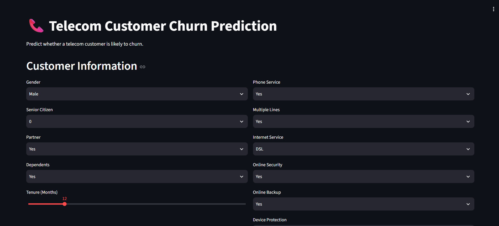
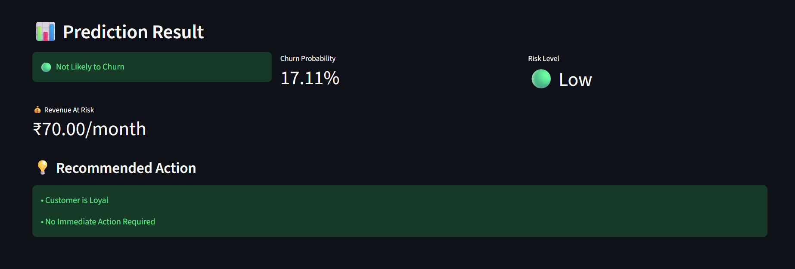

<div align="center">

# 📞 Telecom Customer Churn Prediction

### 🚀 End-to-End Machine Learning Project | Random Forest | Streamlit | Render

<p align="center">
  <a href="https://telecom-churn-prediction-1-sxxj.onrender.com">
    
  </a>
  <a href="https://github.com/sachin-418/Telecom_Churn_Prediction">
    
  </a>
  
  
  
  
</p>

---

### 🌐 **Live Application**

## 👉 https://telecom-churn-prediction-1-sxxj.onrender.com

---

</div>

# 🎯 Project Overview

Customer churn is one of the biggest business challenges in the telecom industry. Retaining an existing customer is significantly cheaper than acquiring a new one.

This project uses **Machine Learning** to predict whether a customer is likely to churn based on demographic information, subscription details, and service usage.

The complete workflow covers:

- Data Cleaning
- Feature Engineering
- Model Building
- Model Evaluation
- Customer Risk Prediction
- Interactive Streamlit Web Application
- Live Deployment on Render

---

# ✨ Features

✅ Predict Telecom Customer Churn

✅ Interactive Streamlit Dashboard

✅ Customer Churn Probability

✅ Customer Risk Analysis

✅ End-to-End ML Pipeline

✅ Automatic Data Preprocessing

✅ Professional Web Interface

✅ Live Deployment

---

# 📊 Dataset

**Dataset:** Telco Customer Churn Dataset

Contains information about:

- Gender
- Senior Citizen
- Partner
- Dependents
- Tenure
- Phone Service
- Internet Service
- Online Security
- Online Backup
- Device Protection
- Tech Support
- Streaming Services
- Contract Type
- Payment Method
- Monthly Charges
- Total Charges

---

# 🧠 Machine Learning Workflow

```text
Raw Data
     │
     ▼
Data Cleaning
     │
     ▼
Feature Engineering
     │
     ▼
Train-Test Split
     │
     ▼
Column Transformer
     │
     ▼
Random Forest Classifier
     │
     ▼
Hyperparameter Tuning
     │
     ▼
Prediction
     │
     ▼
Deployment
```

---

# ⚙️ Technologies Used

| Category | Tools |
|----------|-------|
| Language | Python |
| Data Analysis | Pandas, NumPy |
| Machine Learning | Scikit-learn |
| Model | Random Forest Classifier |
| Deployment | Render |
| Web App | Streamlit |
| Model Saving | Joblib |

---

# 📈 Model Performance

## Accuracy

```text
80.20%
```

## ROC-AUC Score

```text
0.8424
```

### Confusion Matrix

```
[[941  94]
 [185 189]]
```

### Classification Report

| Class | Precision | Recall | F1 |
|--------|-----------|--------|----|
| No Churn | 0.84 | 0.91 | 0.87 |
| Churn | 0.67 | 0.51 | 0.58 |

---

# 📊 Feature Engineering

Created additional features including:

- Number of Active Services
- New Customer Indicator
- Total Charges Calculation
- Encoded Categorical Features
- Service Usage Count

---

# 🖥️ Application Screenshots

## 🏠 Home Page

```
images/home.png
```

<p align="center">

</p>

---

## 📈 Prediction Result

```
images/result.png
```

<p align="center">

</p>

---

# 📂 Project Structure

```text
Telecom_Churn_Prediction/
│
├── app.py
├── telecom_churn_pipeline.pkl
├── requirements.txt
├── README.md
│
├── data/
│   └── WA_Fn-UseC_-Telco-Customer-Churn.csv
│
├── notebooks/
│   └── Telecom_Churn.ipynb
│
└── images/
    ├── home.png
    ├── prediction.png
    └── result.png
```

---

# 🚀 Installation

## Clone Repository

```bash
git clone https://github.com/sachin-418/Telecom_Churn_Prediction.git
```

---

## Navigate

```bash
cd Telecom_Churn_Prediction
```

---

## Install Dependencies

```bash
pip install -r requirements.txt
```

---

## Run Application

```bash
streamlit run app.py
```

---

# 🌍 Live Demo

## 🚀 Render Deployment

https://telecom-churn-prediction-1-sxxj.onrender.com

---

# 💼 Skills Demonstrated

✔ Data Cleaning

✔ Feature Engineering

✔ Exploratory Data Analysis

✔ Machine Learning

✔ Random Forest

✔ Model Evaluation

✔ Hyperparameter Tuning

✔ Streamlit

✔ Deployment

✔ Git & GitHub

---

# 🔮 Future Improvements

- SHAP Explainability
- Customer Segmentation Dashboard
- Revenue-at-Risk Prediction
- Retention Strategy Recommendation
- Email Alert System
- REST API
- Docker Deployment
- CI/CD Pipeline

---

# 👨‍💻 Author

## **Sachin C**

📧 Passionate Machine Learning & AI Enthusiast

GitHub:

https://github.com/sachin-418

---

# ⭐ Show Your Support

If you found this project useful...

⭐ Star the Repository

🍴 Fork the Repository

📢 Share with others

---

<div align="center">

## 🚀 If you like this project, don't forget to ⭐ the repository!

Made with ❤️ by **Sachin C**

</div>
